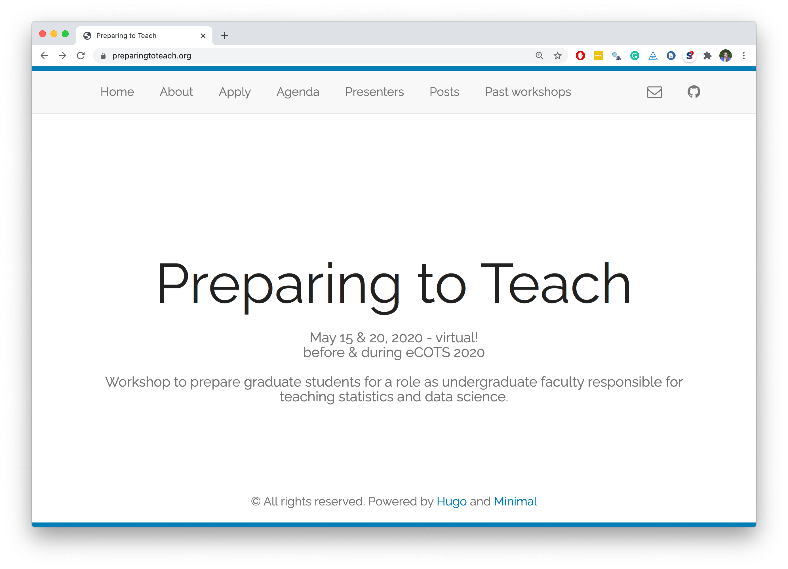

```{r setup, include=FALSE}
options(htmltools.dir.version = FALSE)
```

```{r xaringan-themer, include=FALSE, warning=FALSE}
library(xaringanthemer)
# color inspiration: pantone 2020 colors
# https://store.pantone.com/uk/en/color-of-the-year-2020-palette-exploration
style_duo_accent(
  primary_color = "#0F4C81",   # pantone classic blue
  secondary_color = "#DBCCBE", # pantone pink tint
  black_color = "#7A8387",     # pantone monument
  text_color = "#2A2A35",      # pantone night sky
  header_font_google = google_font("Arvo"),
  text_font_google   = google_font("Montserrat", "300", "300i"),
  code_font_google   = google_font("Source Code Pro"),
  title_slide_text_color = "#DBCCBE",
  base_font_size = "24px",
  text_font_size = "1.2rem",
  link_color = "#B6CADA"
)
```

## Scale vs. personalisation

--
.pull-left[
.hand-gray[Many (mentees) to few (mentors)]
- Great for community building among mentees
- High reach, low "cost" (in terms of mentor time)
- Personal relationships harder to establish
]
--
.pull-right[
.hand-gray[One (mentee) to one (mentor)]
- Great for building personal relationships
- Matching requires more care
- Harder to scale
]

---

.center[
.large[[**preparingtoteach.org**](https://preparingtoteach.org/)]
]

```{r echo=FALSE, out.width="70%", fig.align="center"}

```

---

## Preparing to Teach 

### [**preparingtoteach.org**](https://preparingtoteach.org/)

- Preparing for Careers in Teaching Statistics and Data Science Workshop
- JSM 2018, JSM 2019, eCOTS 2020

--
- Support from NSF, jointly held with IMS New Researchers Group

--
- Slack channel for continued conversation
- Bi-monthly calls on career, teaching, research related topics 
  - Let me know if you'd like to join us!

--

<br>

.hand[Thanks to Beth Chance, Lucy D’Agostino McGowan, Ulrike Genschel, Jo Hardin, Nick Horton, Donna LaLonde, Allan Rossman!]

---

## Preparing to Teach

.pull-left[
**Opportunities**

- Building a network
- Mentees becoming mentors
- Raising voices <sup>*</sup>
]

.pull-right[
**Challenges**

- Building and sustaining a *community*
- Personal relationships
- Rewarding those who mentor
]

.footnote[
.small[[*] Call recaps by Allison Theobold at [preparingtoteach.org/post](https://preparingtoteach.org/post/), workshop recap by Sara Stoudt at [citizen-statistician.org/2020/06/preparing-to-teach-2020-what-did-we-learn](http://www.citizen-statistician.org/2020/06/preparing-to-teach-2020-what-did-we-learn/).]
]

---

.center[
.large[[**bit.ly/ssdse-mentoring**](https://bit.ly/ssdse-mentoring)]
]

```{r echo=FALSE, out.width="70%", fig.align="center"}

```

---

## SSDSE Mentoring Program 

[**bit.ly/ssdse-mentoring**](https://bit.ly/ssdse-mentoring)

- Goal: "Provide career advice and mentoring to help statisticians with a focus on teaching
and education achieve their professional goals."
--

- Mentees interested in graduate, undergraduate, and HS teaching as well as career advice/advancement, leadership/management/communication skills, career goals, etc.
--

- Mentor's role: teaching, problem solving, motivating, guiding, coaching
- Mentee's role: learning, decision making, initiating, risk taking, goal setting
--

- Unprecedented interest this year! 
  - Sign up to be a mentor at [forms.gle/wa5AEaTQMkXBHuPj9](https://docs.google.com/forms/d/e/1FAIpQLSfmwQ5lFCi5xtBuCVPOCC4csouLrOtQYjLQTKOZoFDxwZGChg/viewform)

--

.hand[Thanks to Jenny Green and the [mentoring committee](https://bit.ly/ssdse-mentoring)!]

---

## SSDSE Mentoring Program

.pull-left[
**Opportunities**

- Established structure and support from Section
- Building personal relationships
- Mentorship outside of one's institution

]

.pull-right[
**Challenges**

- Scaling
- Recognition
]

---

## Closing thoughts

- Time is short? Consider **drive by mentoring**:
  - Pass opportunities to colleagues who are earlier in their careers
  - Offer mentorship for the *particular* opportunity you're passing on
  - Pay attention to the diversity profile of those you reach out to

--
- Recognize a need but unable to build a program? Plug in to **established communities**:
  - e.g., R-Ladies - [rladies.org](http://rladies.org/)
  - Direct your students/early-career (or late-career!) colleagues, volunteer your time

--
- Building a new program? Consider
  - **artefacts** mentees can "graduate" with
  - mentors **internal and external** to institution
  - **recognition** for mentor and mentee effort